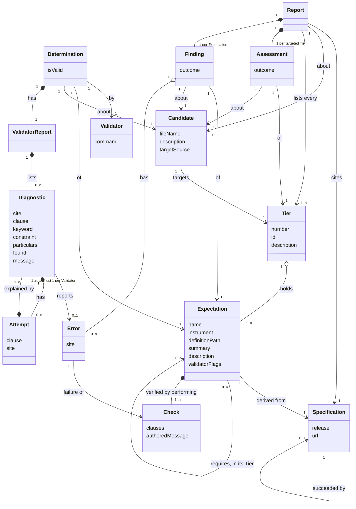

# Checker model: classes

The entities the checker works with, drawn as a class diagram: which entity owns which (the diamonds), which way each relationship points, and in what numbers.

```mermaid
classDiagram
    direction TB

    class Specification {
        release
        url
    }
    Report "1" --> "1" Specification : cites
    Expectation "1" --> "1" Specification : derived from

    class Candidate {
        fileName
        description
        targetSource
    }
    class Tier {
        number
        id
        description
    }
    class Expectation {
        name
        instrument
        definitionPath
        summary
        description
        validatorFlags
    }
    class Validator {
        command
    }
    class Determination {
        isValid
    }
    class ValidatorReport
    class Check {
        clauses
        authoredMessage
    }
    class Error {
        site
    }
    class Diagnostic {
        site
        clause
        keyword
        constraint
        particulars
        found
        message
    }
    class Attempt {
        clause
        site
    }
    class Finding {
        outcome
    }
    class Assessment {
        outcome
    }
    class Report

    Candidate "1" --> "1" Tier : targets
    Tier "1" o-- "1..n" Expectation : holds
    Expectation "0..n" --> "0..n" Expectation : requires, in its Tier
    Expectation "1" *-- "1..n" Check : verified by performing
    Determination "1" --> "1" Validator : by
    Determination "1" --> "1" Expectation : of
    Determination "1" --> "1" Candidate : about
    Determination "1" *-- "1" ValidatorReport : has
    ValidatorReport "1" *-- "0..n" Diagnostic : lists
    Diagnostic "1..n, at most 1 per Validator" --> "0..1" Error : reports
    Error "1" --> "1" Check : failure of
    Diagnostic "1" *-- "0..n" Attempt : has
    Attempt "1" *-- "1..n" Diagnostic : explained by
    Finding "1" --> "1" Expectation : of
    Finding "1" --> "1" Candidate : about
    Finding "1" o-- "0..n" Error : has
    Assessment "1" --> "1" Tier : of
    Assessment "1" --> "1" Candidate : about
    Report "1" --> "1" Candidate : about
    Report "1" --> "1..n" Tier : lists every
    Report "1" *-- "1 per targeted Tier" Assessment
    Report "1" *-- "1 per Expectation" Finding
    Specification "1" --> "0..1" Specification : succeeded by
```
