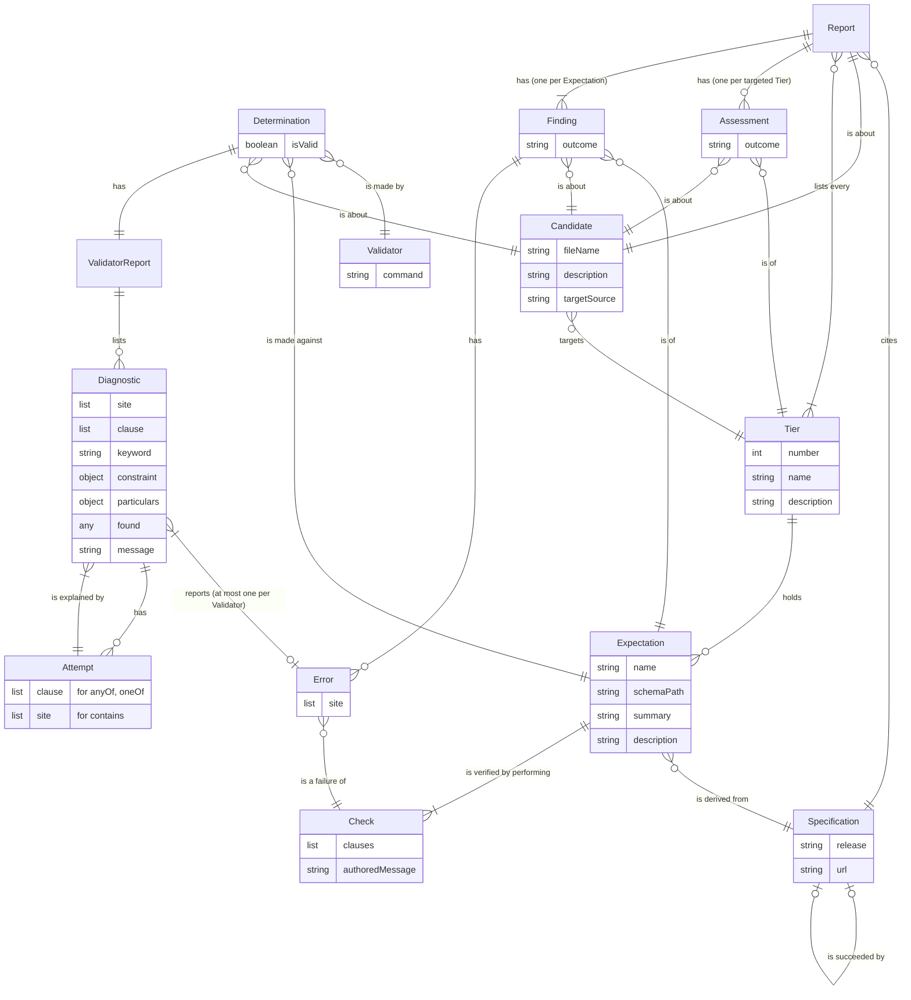

# Checker model: entities and relationships

The entities the checker works with, drawn as an entity-relationship diagram: how many of each at every line end, and a label on each line that completes a sentence from one entity to the other, as in *Error is a failure of Check*.

